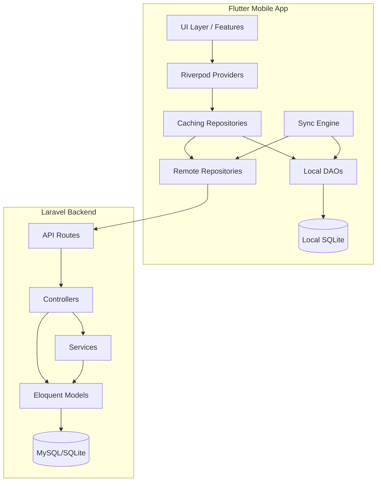
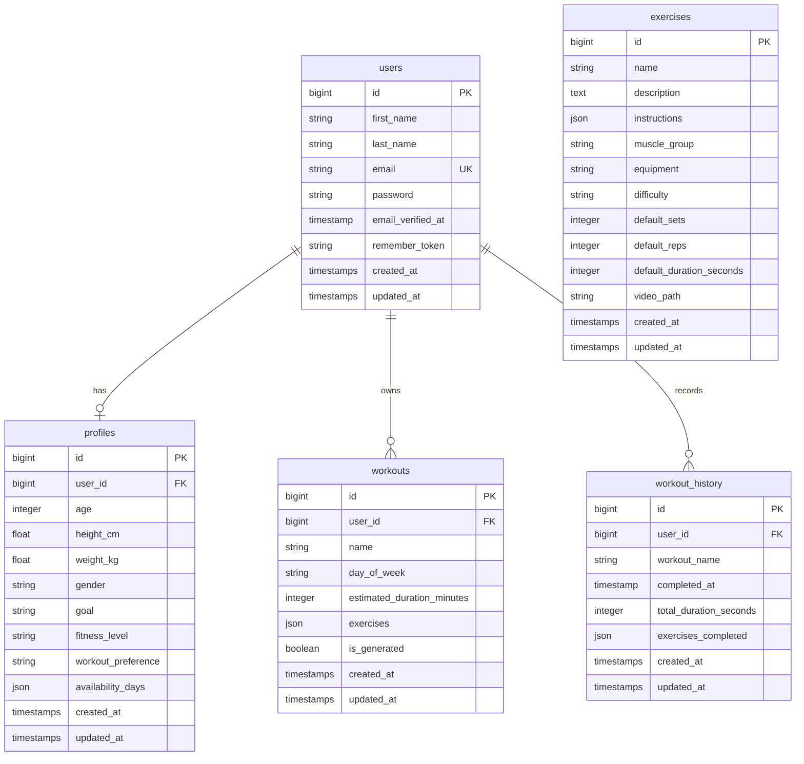

# Design Document: Database Simplification

## Overview

This design consolidates the SyncroFit database from 15+ tables down to 5 core tables: `users`, `exercises`, `workouts`, `workout_history`, and `profiles`. The simplification eliminates redundant join tables (`workout_exercises`, `session_exercises`), feature-specific tables for removed functionality (`device_tokens`, `recommendations`), and separately-stored progress data (`progress_records`, `workout_sessions`) by embedding exercise data as JSON within workouts and deriving progress statistics from workout history.

The change spans both the Laravel backend (schema migrations, model refactoring, controller consolidation, route updates) and the Flutter frontend (model updates, DAO rewrites, local SQLite schema migration, caching repository changes, and removal of dead code paths).

### Design Rationale

1. **JSON embedding over join tables**: Exercises within a workout are always loaded together and never queried independently. Storing them as a JSON column eliminates N+1 queries and removes the `workout_exercises` table entirely.
2. **Unified workouts table**: User-created and recommendation-generated workouts share identical structure. The `is_generated` boolean flag distinguishes them without requiring a separate `recommendations` table.
3. **Derived progress**: Progress statistics (total workouts, weekly stats, streaks) can be computed from `workout_history` records with simple aggregation queries, eliminating the need for a separate `progress_records` table.
4. **Removed features**: Push notifications (`device_tokens`) are not in active use and are dropped entirely.

## Architecture

### System Architecture Diagram



### Migration Strategy

The database migration is implemented as a single Laravel migration file that:
1. Drops obsolete tables in dependency order (session_exercises → workout_sessions → workout_exercises → recommendations → progress_records → device_tokens)
2. Alters the exercises table (rename `image_url` → `video_path`)
3. Recreates the workouts table with the new schema (user_id FK, exercises JSON, is_generated flag)
4. Creates the new workout_history table

The Flutter local database increments its schema version and runs a destructive migration (drop and recreate) since the local cache is ephemeral and will be repopulated from the API.

## Components and Interfaces

### Backend Components

#### Migration: `SimplifyDatabaseSchema`

- Drops tables: `session_exercises`, `workout_sessions`, `workout_exercises`, `recommendations`, `progress_records`, `device_tokens`
- Renames `exercises.image_url` → `exercises.video_path`
- Drops and recreates `workouts` table with new schema
- Creates `workout_history` table
- Provides `down()` method that reverses all changes

#### Model: `Exercise`

```php
// Fillable: name, description, instructions, muscle_group, equipment, difficulty,
//           default_sets, default_reps, default_duration_seconds, video_path
// Casts: instructions → array
// Relationships: none (standalone reference table)
```

#### Model: `Workout`

```php
// Fillable: user_id, name, day_of_week, estimated_duration_minutes, exercises, is_generated
// Casts: exercises → array, is_generated → boolean
// Relationships: belongsTo(User)
```

#### Model: `WorkoutHistory`

```php
// Fillable: user_id, workout_name, completed_at, total_duration_seconds, exercises_completed
// Casts: exercises_completed → array, completed_at → datetime
// Relationships: belongsTo(User)
```

#### Controller: `WorkoutController`

| Endpoint | Method | Description |
|----------|--------|-------------|
| `GET /workouts` | index | List user's workouts (filterable by is_generated) |
| `POST /workouts` | store | Create a user-defined workout |
| `POST /workouts/generate` | generate | Generate workouts via RecommendationEngine |
| `GET /workouts/generated` | generated | List only generated workouts |

#### Controller: `WorkoutHistoryController`

| Endpoint | Method | Description |
|----------|--------|-------------|
| `POST /workout-history` | store | Record a completed workout session |
| `GET /workout-history` | index | List workout history for authenticated user |
| `GET /workout-history/stats` | stats | Compute progress statistics from history |

#### Service: `RecommendationEngine` (modified)

The existing `RecommendationEngine::generate()` is updated to:
- Store generated workouts directly in the `workouts` table with `is_generated = true`
- Remove dependency on `WorkoutSession` / `SessionExercise` for adaptation factor calculation
- Use `workout_history` records to compute the adaptation factor instead

### Frontend Components

#### Model: `Exercise` (updated)

```dart
class Exercise {
  final String id;
  final String name;
  final String muscleGroup;
  final String difficulty;
  final String instructions;
  final String? equipment;
  final int defaultDurationSeconds;
  final int defaultSets;
  final int defaultReps;
  final String? videoPath; // replaces imagePlaceholder
}
```

#### Model: `Workout` (updated)

```dart
class Workout {
  final String id;
  final String? userId;
  final String name;
  final String? dayOfWeek;
  final int estimatedDurationMinutes;
  final List<WorkoutExercise> exercises;
  final bool isGenerated;
  final DateTime? createdAt;
  final DateTime? updatedAt;
}
```

#### Model: `WorkoutHistory` (new)

```dart
class WorkoutHistory {
  final String id;
  final String userId;
  final String workoutName;
  final DateTime completedAt;
  final int totalDurationSeconds;
  final List<Map<String, dynamic>> exercisesCompleted;
  final DateTime? createdAt;
  final DateTime? updatedAt;
}
```

#### DAO: `WorkoutDao` (updated)

- Handles `is_generated` column read/write
- Handles `user_id` and `day_of_week` columns
- Serializes/deserializes exercises JSON as before

#### DAO: `WorkoutHistoryDao` (new)

- `insertRecord(WorkoutHistory)` — insert a completed workout record
- `getByUser(String userId)` — retrieve all history for a user
- `getByDateRange(String userId, DateTime start, DateTime end)` — query by date range
- `deleteAll()` — clear cache

#### Caching Repository Updates

- `CachingWorkoutRepository` — uses updated `Workout` model with `isGenerated`
- `CachingWorkoutHistoryRepository` (new) — replaces `CachingProgressRepository`
- `SyncQueue` — handles `workout_history` entity type for offline sync

### Removed Components

**Backend:**
- Controllers: `DeviceTokenController`, `ProgressController`, `WorkoutSessionController`, `RecommendationController`
- Models: `DeviceToken`, `ProgressRecord`, `Recommendation`, `WorkoutExercise`, `SessionExercise`, `WorkoutSession`
- Service: `NotificationService`

**Frontend:**
- DAOs: `progress_dao.dart`
- Repositories: `caching_progress_repository.dart`, `remote_progress_repository.dart`, `remote_notification_repository.dart`
- Models: `WorkoutSession` (replaced by `WorkoutHistory`)
- Features: `notifications/` folder, refactored `progress/` folder
- Mocks: `mock_progress_repository.dart`, `mock_notification_repository.dart`

## Data Models

### Backend Database Schema (Post-Migration)



### Exercises JSON Structure (within workouts.exercises)

```json
[
  {
    "exercise_id": 1,
    "sets": 3,
    "reps": 12,
    "duration_seconds": 45,
    "order": 1
  },
  {
    "exercise_id": 2,
    "sets": 4,
    "reps": 10,
    "duration_seconds": 60,
    "order": 2
  }
]
```

### Exercises Completed JSON Structure (within workout_history.exercises_completed)

```json
[
  {
    "exercise_id": 1,
    "exercise_name": "Push Ups",
    "sets_completed": 3,
    "reps_completed": 12,
    "skipped": false
  },
  {
    "exercise_id": 2,
    "exercise_name": "Squats",
    "sets_completed": 4,
    "reps_completed": 10,
    "skipped": false
  }
]
```

### Flutter Local SQLite Schema (v2)

```sql
CREATE TABLE exercises (
  id TEXT PRIMARY KEY,
  name TEXT NOT NULL,
  muscle_group TEXT NOT NULL,
  difficulty TEXT NOT NULL,
  instructions TEXT NOT NULL,
  equipment TEXT,
  default_duration_seconds INTEGER NOT NULL,
  default_sets INTEGER NOT NULL,
  default_reps INTEGER NOT NULL,
  video_path TEXT
);

CREATE TABLE workouts (
  id TEXT PRIMARY KEY,
  user_id TEXT,
  name TEXT NOT NULL,
  day_of_week TEXT,
  estimated_duration_minutes INTEGER NOT NULL,
  exercises TEXT NOT NULL,
  is_generated INTEGER NOT NULL DEFAULT 0,
  created_at TEXT,
  updated_at TEXT
);

CREATE TABLE workout_history (
  id TEXT PRIMARY KEY,
  user_id TEXT NOT NULL,
  workout_name TEXT NOT NULL,
  completed_at TEXT NOT NULL,
  total_duration_seconds INTEGER NOT NULL,
  exercises_completed TEXT NOT NULL,
  created_at TEXT,
  updated_at TEXT
);

CREATE TABLE user_profile (
  user_id TEXT PRIMARY KEY,
  name TEXT NOT NULL,
  age INTEGER NOT NULL,
  height_cm REAL NOT NULL,
  weight_kg REAL NOT NULL,
  gender TEXT NOT NULL,
  fitness_goal TEXT NOT NULL,
  fitness_level TEXT NOT NULL,
  workout_preference TEXT NOT NULL,
  availability_days TEXT NOT NULL,
  updated_at TEXT NOT NULL
);

CREATE TABLE sync_queue (
  id TEXT PRIMARY KEY,
  entity_type TEXT NOT NULL,
  entity_id TEXT NOT NULL,
  operation_type TEXT NOT NULL,
  payload TEXT NOT NULL,
  created_at TEXT NOT NULL,
  retry_count INTEGER NOT NULL DEFAULT 0,
  status TEXT NOT NULL DEFAULT 'pending'
);

CREATE TABLE cache_metadata (
  entity_type TEXT PRIMARY KEY,
  last_synced_at TEXT NOT NULL
);
```


## Correctness Properties

*A property is a characteristic or behavior that should hold true across all valid executions of a system — essentially, a formal statement about what the system should do. Properties serve as the bridge between human-readable specifications and machine-verifiable correctness guarantees.*

### Property 1: Exercise name to video_path format conversion

*For any* valid exercise name string, applying the video_path generation function SHALL produce a string matching the pattern `assets/videos/{snake_case_name}.mp4`, where the snake_case_name is the lowercase, underscore-separated version of the exercise name.

**Validates: Requirements 2.5**

### Property 2: Workout exercises JSON round-trip (Backend)

*For any* valid array of exercise objects (each containing exercise_id, sets, reps, duration_seconds, and order), storing the array in a Workout model's `exercises` column and reading it back SHALL produce an identical array.

**Validates: Requirements 3.2**

### Property 3: Workout exercises JSON validation

*For any* JSON array where at least one object is missing any of the required fields (exercise_id, sets, reps, duration_seconds, order), the workout validation SHALL reject the input. Conversely, *for any* JSON array where all objects contain all required fields with valid types, the validation SHALL accept the input.

**Validates: Requirements 3.5**

### Property 4: WorkoutHistory exercises_completed JSON round-trip (Backend)

*For any* valid array of exercise completion objects, storing the array in a WorkoutHistory model's `exercises_completed` column and reading it back SHALL produce an identical array.

**Validates: Requirements 4.2**

### Property 5: Progress statistics computation correctness

*For any* set of workout_history records belonging to a user, the computed progress statistics SHALL satisfy: total_workouts equals the count of records, total_duration equals the sum of all total_duration_seconds values, and weekly_stats groups records correctly by ISO week.

**Validates: Requirements 5.7**

### Property 6: Frontend Workout model and DAO serialization round-trip

*For any* valid Workout object (with exercises list, isGenerated flag, dayOfWeek, and userId), serializing it to a DAO row, storing it in SQLite, reading it back, and deserializing SHALL produce an equivalent Workout object with identical exercises list and metadata.

**Validates: Requirements 9.2, 9.3, 11.4**

### Property 7: Frontend WorkoutHistory model serialization round-trip

*For any* valid WorkoutHistory object (with completedAt datetime, totalDurationSeconds, and exercisesCompleted list), calling toJson() then fromJson() SHALL produce an equivalent WorkoutHistory object.

**Validates: Requirements 10.2**

### Property 8: Frontend Exercise DAO video_path round-trip

*For any* valid Exercise object with a non-null videoPath, inserting via the Exercise DAO and reading back by ID SHALL produce an Exercise with an identical videoPath value.

**Validates: Requirements 8.2, 11.3**

### Property 9: WorkoutHistory DAO date range query correctness

*For any* set of WorkoutHistory records with various completedAt timestamps and *for any* date range [start, end], querying the DAO by that range SHALL return exactly those records whose completedAt falls within the range (inclusive).

**Validates: Requirements 11.5**

## Error Handling

### Backend Error Handling

| Scenario | Response Code | Behavior |
|----------|--------------|----------|
| Invalid exercises JSON on workout creation | 422 | Return validation errors listing missing required fields |
| Workout not found | 404 | Standard Laravel model not found response |
| Unauthorized access to another user's workouts | 403 | Forbidden response |
| Unauthenticated request to protected route | 401 | Sanctum returns unauthenticated |
| Invalid date format on workout history creation | 422 | Validation error |
| Database constraint violation (e.g., non-existent user_id) | 500 | Caught by exception handler, logged, generic error returned |
| Migration rollback failure | Exception | Laravel's migration system handles transaction rollback |

### Frontend Error Handling

| Scenario | Behavior |
|----------|----------|
| Local database schema upgrade fails | Delete and recreate database (cache is ephemeral) |
| Exercises JSON deserialization fails | Log error, skip malformed exercises, return partial list |
| WorkoutHistory record fails to sync | SyncQueue retries with exponential backoff (max 3 retries) |
| Video asset not found for videoPath | Display placeholder icon |
| API returns 401 during sync | Redirect to login, pause sync queue |
| API returns 422 on workout creation | Display validation errors to user |
| Network timeout during history fetch | Serve from local cache, queue retry |

### Validation Rules

**Workout creation (POST /workouts):**
- `name`: required, string, max 255 characters
- `day_of_week`: nullable, string, must be a valid day name
- `estimated_duration_minutes`: nullable, integer, min 1
- `exercises`: required, valid JSON array
- `exercises.*.exercise_id`: required, integer, exists in exercises table
- `exercises.*.sets`: required, integer, min 1, max 20
- `exercises.*.reps`: required, integer, min 1, max 100
- `exercises.*.duration_seconds`: required, integer, min 0
- `exercises.*.order`: required, integer, min 1

**Workout history creation (POST /workout-history):**
- `workout_name`: required, string, max 255 characters
- `completed_at`: required, valid ISO 8601 datetime
- `total_duration_seconds`: required, integer, min 0
- `exercises_completed`: required, valid JSON array

## Testing Strategy

### Property-Based Testing

This feature is suitable for property-based testing in the following areas:
- **Model serialization round-trips** (JSON casting, toJson/fromJson symmetry)
- **Validation logic** (exercises JSON field presence/absence)
- **Computation correctness** (progress stats aggregation)
- **DAO data integrity** (store/retrieve preserves data)
- **Date range query logic** (filtering correctness)

**Library Selection:**
- Backend (PHP/Laravel): [Eris](https://github.com/giorgiosironi/eris) — property-based testing library for PHPUnit
- Frontend (Dart/Flutter): [glados](https://pub.dev/packages/glados) — property-based testing for Dart

**Configuration:**
- Minimum 100 iterations per property test
- Each property test tagged with: `Feature: database-simplification, Property {N}: {title}`

### Unit Tests (Example-Based)

- Exercise model fillable attributes contain `video_path`, exclude `image_url`
- Workout model `is_generated` cast returns boolean
- WorkoutHistory model `completed_at` cast returns DateTime
- User model has `workoutHistory()` relationship, lacks removed relationships
- API routes return 401 for unauthenticated access
- Removed routes return 404
- Existing auth/profile/exercise routes still work

### Integration Tests

- `POST /workouts` creates a workout with embedded exercises JSON
- `POST /workouts/generate` calls RecommendationEngine and stores workouts with `is_generated=true`
- `POST /workout-history` creates a record and returns it
- `GET /workout-history/stats` returns correct aggregates for seeded test data
- Flutter caching repository reads/writes workouts with new schema
- SyncQueue processes workout_history mutations correctly

### Smoke Tests

- Migration up: all obsolete tables are dropped, new tables exist with correct columns
- Migration down: all tables are recreated with original schema
- Flutter local database initializes with v2 schema (new tables, no old tables)
- ExerciseSeeder populates `video_path` values in correct format

### Test Execution Order

1. Run backend migrations in test environment
2. Run smoke tests (schema verification)
3. Run property-based tests (data integrity)
4. Run unit tests (model/route checks)
5. Run integration tests (end-to-end flows)
6. Run Flutter unit/widget tests
