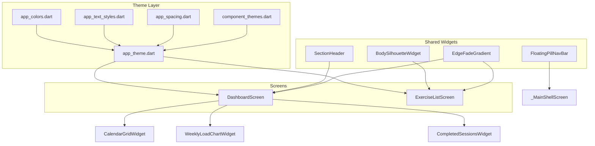

# Design Document: Geist UI Redesign

## Overview

This design covers the visual redesign of SyncroFit to adopt a Geist-inspired aesthetic. The redesign touches the theme system (fonts, colors, component styles), three core screens (Exercise Library, Dashboard, Bottom Navigation), and introduces new reusable widgets (Section Header, Body Silhouette, Edge Fade Gradient). The approach modifies existing infrastructure in `lib/core/theme/` and refactors screen-level widgets in `lib/features/dashboard/` and `lib/features/exercise_library/`.

The architecture remains Flutter + Riverpod + GoRouter. No new packages are introduced — the existing `google_fonts` package already supports Geist and Geist Mono. The `fl_chart` package handles the weekly load bar chart. The redesign is purely presentational; data models and repositories remain unchanged.

## Architecture



### Key Architectural Decisions

1. **Theme-first approach**: All visual changes are driven from centralized theme files. Screens consume theme tokens rather than hardcoding values. This allows the redesign to propagate globally.

2. **Shared widget extraction**: New widgets (SectionHeader, BodySilhouetteWidget, EdgeFadeGradient) are placed in `lib/shared/widgets/` for reuse across features.

3. **Dashboard decomposition**: The dashboard screen is split into focused sub-widgets (CalendarGrid, WeeklyLoadChart, CompletedSessions) inside `lib/features/dashboard/widgets/`, each with its own responsibility.

4. **Navigation bar in shell**: The floating pill nav bar remains in `app_router.dart`'s shell screen builder but is refactored to match the updated 5-destination spec with icon-only rendering.

5. **No new dependencies**: Geist and Geist Mono are available via `google_fonts ^6.2.1` (already in pubspec). Bar charts use the existing `fl_chart ^0.70.2`.

## Components and Interfaces

### Theme Components

#### `AppColors` (modified)

Remove chromatic fitness colors (`successGreen`, `warningOrange`, `errorRed`, `restBlue`) from default usage. Add explicit constants for the Geist dark palette:

```dart
abstract final class AppColors {
  // Backgrounds
  static const Color scaffoldBlack = Color(0xFF000000);
  static const Color cardFill = Color(0xFF1A1A1A);
  static const Color cardBorder = Color(0xFF2A2A2A);
  static const Color containerBorder = Color(0xFF3D3D3D);

  // Navigation
  static const Color navBarFill = Color(0xFF424242);
  static const Color iconInactive = Color(0xFF6B6B6B);

  // Text
  static const Color textPrimary = Color(0xFFFFFFFF);
  static const Color textSecondary = Color(0xB3FFFFFF); // 70% white
  static const Color textHint = Color(0x99FFFFFF);       // 60% white

  // Interactive states
  static const Color pressedOverlay = Color(0x33FFFFFF); // 20% white
  static const Color focusBorder = Color(0xFFFFFFFF);
  static const Color disabledText = Color(0x66FFFFFF);   // 40% white
}
```

#### `AppTextStyles` (modified)

Replace `GoogleFonts.poppins()` and `GoogleFonts.inter()` with `GoogleFonts.geist()`. Add a `sectionHeader` style using `GoogleFonts.geistMono()`:

```dart
abstract final class AppTextStyles {
  static final TextStyle headlineLarge = GoogleFonts.geist(
    fontSize: 32, fontWeight: FontWeight.w700, letterSpacing: 0,
  );
  // ... all other styles migrate to GoogleFonts.geist() ...

  static final TextStyle sectionHeader = GoogleFonts.geistMono(
    fontSize: 12, fontWeight: FontWeight.w500, letterSpacing: 1.5,
  );
}
```

Font fallback: `google_fonts` automatically falls back to platform sans-serif if the font asset fails to download. No explicit error handling is needed.

#### `AppSpacing` (unchanged)

The current spacing scale (xs=4, sm=8, md=16, lg=24, xl=32, xxl=48) already satisfies the requirement for named spacing constants. The base unit `md=16` is within the 12–16dp range.

#### `ComponentThemes` (modified)

- `cardThemeDark()`: Change border from white to `AppColors.cardBorder` (0xFF2A2A2A), fill to `AppColors.cardFill` (0xFF1A1A1A), ensure elevation=0, radius=12.
- `navigationBarTheme()`: Update icon colors to white (active) / `AppColors.iconInactive` (inactive), ensure `labelBehavior: alwaysHide`.
- Add dark-mode `inputDecorationTheme` variant with grey borders.
- Interactive states: pressed overlay at 20% white, focused with 1px white border, disabled at 40% opacity.

### Shared Widgets

#### `SectionHeader`

A stateless widget rendering a left title + optional right label in uppercase Geist Mono.

```dart
class SectionHeader extends StatelessWidget {
  final String title;
  final String? trailingLabel;

  // Renders title in AppTextStyles.sectionHeader, uppercased
  // Renders trailingLabel at 0.5 opacity if present
}
```

#### `BodySilhouetteWidget`

A `CustomPainter`-based widget that draws a grey body outline and places white dots at muscle group positions.

```dart
class BodySilhouetteWidget extends StatelessWidget {
  final List<String> targetedMuscleGroups;
  final double height; // default ~60dp

  // Uses a CustomPainter with predefined path data for body outline
  // Maps muscle group names to (x, y) positions for white dot placement
}
```

#### `EdgeFadeGradient`

A non-interactive gradient overlay widget.

```dart
class EdgeFadeGradient extends StatelessWidget {
  final bool isTop; // true = fades from black to transparent downward
  final double height; // 24–48dp

  // Returns IgnorePointer wrapping a Container with LinearGradient
  // Colors: [scaffoldBlack, Colors.transparent] (top) or reversed (bottom)
}
```

### Screen Widgets

#### Dashboard Widgets (`lib/features/dashboard/widgets/`)

| Widget | Responsibility |
|--------|---------------|
| `CalendarGridWidget` | Renders month grid with workout indicators, emits selected date |
| `WeeklyLoadChartWidget` | Renders 4-bar volume chart using fl_chart |
| `CompletedSessionsWidget` | Shows session count and list for selected date |

#### Exercise Library Widgets (`lib/features/exercise_library/widgets/`)

| Widget | Responsibility |
|--------|---------------|
| `ExerciseRow` | Single exercise item with name, subtitle, body silhouette |

### Navigation

The `_MainShellScreen` is updated to 5 navigation destinations:

| Index | Icon (outlined/filled) | Section |
|-------|----------------------|---------|
| 0 | `Icons.grid_view` / `Icons.grid_view` | Dashboard |
| 1 | `Icons.fitness_center_outlined` / `Icons.fitness_center` | Workout |
| 2 | `Icons.calendar_today_outlined` / `Icons.calendar_today` | Calendar |
| 3 | `Icons.chat_bubble_outline` / `Icons.chat_bubble` | Community |
| 4 | `Icons.search` / `Icons.search` | Search |

Touch target: each destination occupies at least 48×48dp within the 56dp-high pill container.

## Data Models

No new data models are introduced. The redesign relies on existing models:

- **`Exercise`** — provides `name`, `muscleGroup`, `equipment` for Exercise Library rows
- **`WorkoutSession`** — provides `completedAt`, `exercises` (list of `CompletedExercise`) for calendar and weekly load calculations
- **`CompletedExercise`** — provides `setsCompleted`, `repsOrDuration` for volume calculation (sets × reps)

### Derived Data (Provider Logic)

#### Weekly Load Calculation

```dart
// Volume for a week = sum of (setsCompleted * repsOrDuration) across all CompletedExercise
// in all WorkoutSession where completedAt falls within that week's Monday–Sunday range.
int calculateWeeklyVolume(List<WorkoutSession> sessions, DateTime weekStart) {
  return sessions
    .where((s) => isInWeek(s.completedAt, weekStart))
    .expand((s) => s.exercises)
    .fold(0, (sum, e) => sum + e.setsCompleted * e.repsOrDuration);
}
```

#### Calendar Day Status

```dart
enum DayStatus { completed, today, normal }
// completed: at least one WorkoutSession.completedAt on that date
// today: DateTime.now() matches the date and no completed session
// normal: all other days
```

#### Completed Sessions for Date

```dart
// Filter WorkoutSession list where completedAt matches selected date
// Return count + list of (workoutName, totalDurationSeconds / 60)
```


## Correctness Properties

*A property is a characteristic or behavior that should hold true across all valid executions of a system — essentially, a formal statement about what the system should do. Properties serve as the bridge between human-readable specifications and machine-verifiable correctness guarantees.*

### Property 1: Dark theme colors are achromatic

*For any* color value extracted from the dark theme's ColorScheme, CardTheme, NavigationBarTheme, AppBarTheme, and InputDecorationTheme defaults (excluding explicitly user-provided content colors), the color's red, green, and blue channels SHALL be equal (R == G == B), confirming a pure greyscale palette.

**Validates: Requirements 2.6**

### Property 2: Calendar grid contains correct day count for any month

*For any* valid year (2000–2100) and month (1–12), the calendar grid generation function SHALL produce exactly N day cells where N equals the number of days in that month, plus empty leading cells equal to (firstDayOfMonth.weekday - 1) when Monday=1, and the total cell count SHALL be divisible by 7 when padded with trailing empty cells.

**Validates: Requirements 4.3**

### Property 3: Day status classification is exhaustive and correct

*For any* date within the displayed month and any set of completed workout dates, the day status function SHALL return `completed` if and only if the date exists in the completed set, `today` if and only if the date equals today's date and is not in the completed set, and `normal` in all other cases — with exactly one status assigned per date.

**Validates: Requirements 4.4, 4.5, 4.6**

### Property 4: Four-week ranges are non-overlapping and chronologically ordered

*For any* reference date (today), the computed four week ranges SHALL each span exactly 7 days (Monday 00:00 to Sunday 23:59), be non-overlapping, be in strictly ascending chronological order (W1 oldest, W4 most recent), and the union of all four ranges SHALL cover exactly 28 consecutive days ending on the Sunday of or before the reference date's week.

**Validates: Requirements 5.2**

### Property 5: Weekly volume calculation equals sum of sets times reps

*For any* list of CompletedExercise items (including empty lists), the calculated weekly volume SHALL equal the sum of (setsCompleted × repsOrDuration) for each item, and SHALL be a non-negative integer.

**Validates: Requirements 5.3**

### Property 6: Bar height scaling is proportional to maximum volume

*For any* four non-negative integer volume values where at least one is greater than zero, the computed bar height for each week SHALL satisfy: `height[i] / maxChartHeight == volume[i] / maxVolume` (within floating-point tolerance). When all four volumes are zero, all bar heights SHALL be equal to a defined minimum height.

**Validates: Requirements 5.6, 5.7**

### Property 7: Date display formatting round-trip

*For any* valid DateTime (year 2000–2100, months 1–12, valid day for that month), the formatted display string SHALL match the pattern "{FullMonthName} {Day}, {Year}" where FullMonthName is the English month name, Day is the day number without leading zeros, and Year is the 4-digit year.

**Validates: Requirements 6.2**

### Property 8: Duration formatting correctness

*For any* non-negative integer representing total seconds, the formatted duration string SHALL equal "{n} min" where n equals (totalSeconds / 60) rounded to the nearest integer, with n being at least 0.

**Validates: Requirements 6.4**

### Property 9: Muscle group positions are within body outline bounds

*For any* valid muscle group name from the supported set, the mapped dot position (x, y) SHALL fall within the body silhouette bounding box (0 ≤ x ≤ width, 0 ≤ y ≤ height), ensuring no dots render outside the outline.

**Validates: Requirements 3.4**

## Error Handling

| Scenario | Handling Strategy |
|----------|-----------------|
| Geist font fails to load | `google_fonts` falls back to platform sans-serif automatically. No user-visible error. |
| No workout sessions exist | Weekly Load Chart renders all bars at minimum height with grey fill and "0" labels. Calendar shows no filled circles. |
| No sessions for selected date | Completed Sessions section shows empty-state message. |
| Dashboard provider fails to load | Existing `ErrorDisplay` widget with retry button (unchanged). |
| Exercise provider fails to load | Existing `ErrorDisplay` widget with retry button (unchanged). |
| Invalid month/year in calendar | Guard with `DateTime` validation; default to current month if invalid. |
| Empty exercise list (no results) | Existing `EmptyState` widget (unchanged). |

All error states use white text with descriptive labels per Requirement 2.7 — no chromatic status colors.

## Testing Strategy

### Unit Tests (Example-Based)

Focus on concrete scenarios and widget rendering:

- **Theme smoke tests**: Verify all color, font, spacing, and component theme values match spec (Requirements 1.1–1.3, 2.1–2.5, 2.8, 9.1–9.4, 11.1)
- **Widget structure tests**: Verify SectionHeader renders uppercase text, EdgeFadeGradient uses IgnorePointer, BodySilhouetteWidget renders correct number of dots
- **Navigation tests**: Verify 5 destinations render, tap switches tabs, active/inactive icon colors
- **Screen integration tests**: Verify Dashboard shows CalendarGrid + WeeklyLoadChart + CompletedSessions, Exercise Library shows rows without cards/badges

### Property-Based Tests

Using the `glados` package (already in dev_dependencies) for property-based testing.

Each property test runs a minimum of 100 iterations with randomized inputs:

| Property | Test Description | Tag |
|----------|-----------------|-----|
| 1 | Extract all colors from dark theme, assert R==G==B | Feature: geist-ui-redesign, Property 1: Dark theme colors are achromatic |
| 2 | Generate random year/month, verify grid cell count | Feature: geist-ui-redesign, Property 2: Calendar grid day count |
| 3 | Generate random dates + completed set, verify status classification | Feature: geist-ui-redesign, Property 3: Day status classification |
| 4 | Generate random reference dates, verify 4 week ranges | Feature: geist-ui-redesign, Property 4: Four-week ranges |
| 5 | Generate random CompletedExercise lists, verify volume sum | Feature: geist-ui-redesign, Property 5: Weekly volume calculation |
| 6 | Generate 4 random volumes, verify bar height ratios | Feature: geist-ui-redesign, Property 6: Bar height scaling |
| 7 | Generate random DateTimes, verify format pattern | Feature: geist-ui-redesign, Property 7: Date display formatting |
| 8 | Generate random second values, verify "{n} min" format | Feature: geist-ui-redesign, Property 8: Duration formatting |
| 9 | Generate random muscle group names from supported set, verify position bounds | Feature: geist-ui-redesign, Property 9: Muscle group positions |

### Test Organization

```
test/
├── core/
│   └── theme/
│       ├── app_colors_test.dart          # Smoke: color values
│       ├── app_text_styles_test.dart      # Smoke: font families/weights
│       ├── dark_theme_greyscale_test.dart # Property 1
│       └── component_themes_test.dart    # Smoke: card/nav styles
├── features/
│   ├── dashboard/
│   │   ├── widgets/
│   │   │   ├── calendar_grid_test.dart        # Properties 2, 3
│   │   │   ├── weekly_load_chart_test.dart    # Properties 4, 5, 6
│   │   │   └── completed_sessions_test.dart   # Properties 7, 8
│   │   └── screens/
│   │       └── dashboard_screen_test.dart     # Widget integration
│   └── exercise_library/
│       ├── widgets/
│       │   ├── body_silhouette_test.dart      # Property 9
│       │   └── exercise_row_test.dart         # Example tests
│       └── screens/
│           └── exercise_list_screen_test.dart  # Widget integration
└── shared/
    └── widgets/
        ├── section_header_test.dart           # Example tests
        └── edge_fade_gradient_test.dart       # Example tests
```
