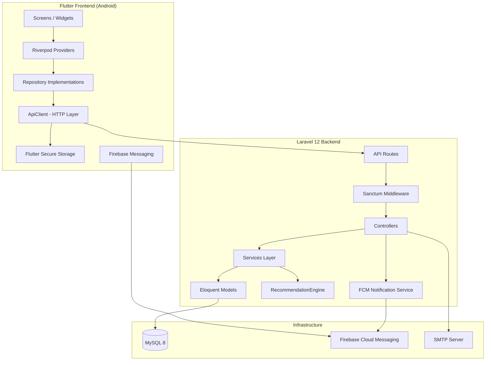
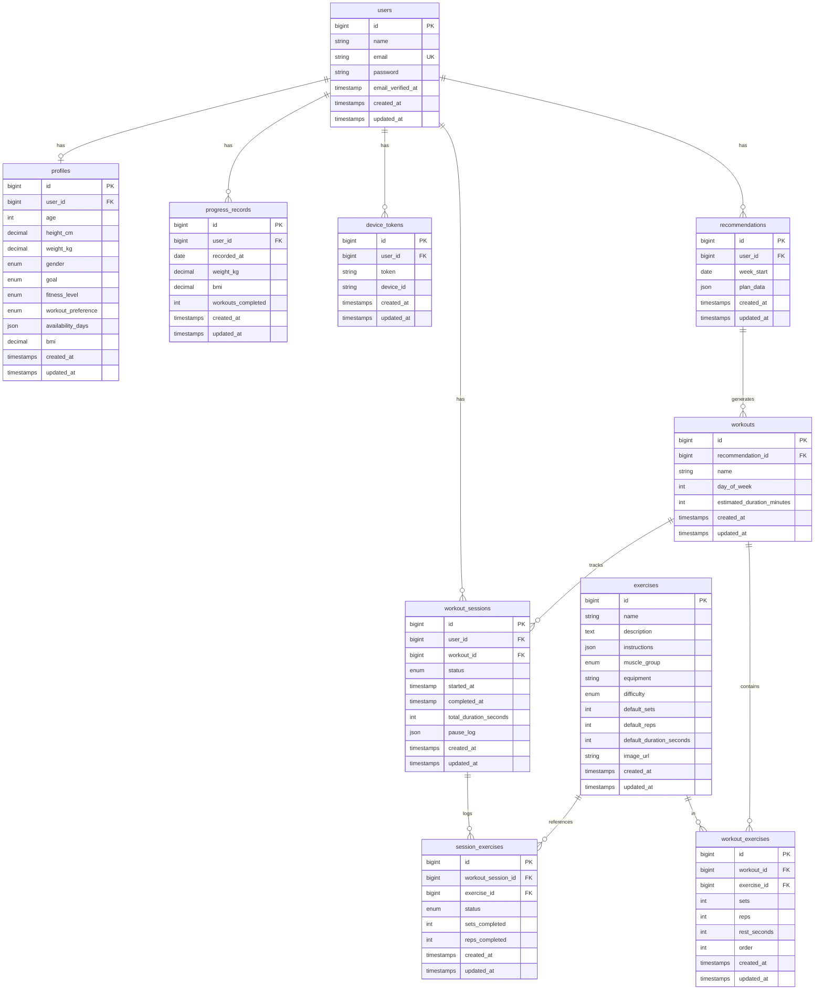

# Design Document: SynchroFit Backend Integration

## Overview

This design covers the full-stack implementation of the SynchroFit backend (Laravel 12 + MySQL 8 + Sanctum) and its integration with the existing Flutter frontend. The approach is vertical-slice: each API feature is implemented in Laravel, then the corresponding Flutter screen is wired to consume real data by replacing mock repositories with HTTP-backed implementations.

The Flutter app already has a well-structured architecture with abstract repository interfaces, mock implementations, Riverpod state management, and GoRouter navigation. The backend integration adds:

1. A Laravel 12 REST API with Sanctum token authentication
2. A centralized `ApiClient` in Flutter that handles token management, error mapping, and loading states
3. Real repository implementations that delegate to the `ApiClient`
4. A recommendation engine service in Laravel
5. Firebase Cloud Messaging (FCM) integration for push notifications

The design preserves the existing Flutter architecture and simply swaps mock implementations for real HTTP-backed ones via Riverpod provider overrides.

## Architecture

### High-Level System Architecture



### Backend Architecture (Laravel)

The Laravel backend follows a Controller → Service → Model layered pattern:

- **Controllers**: Handle HTTP request/response concerns, input validation, and response formatting
- **Services**: Contain business logic (e.g., `RecommendationEngine`, `ProgressService`)
- **Models**: Eloquent models with relationships, scopes, and computed attributes
- **Form Requests**: Laravel Form Request classes for validation rules
- **Resources**: API Resources for consistent JSON transformation

### Frontend Integration Architecture (Flutter)

The Flutter integration introduces a new `data/remote/` layer:

```
lib/
├── core/
│   ├── network/
│   │   ├── api_client.dart          # Centralized HTTP client
│   │   ├── api_config.dart          # Base URL, timeouts
│   │   └── token_storage.dart       # Secure token persistence
│   └── ...
├── data/
│   ├── mock/                        # Existing mock implementations (kept for dev)
│   ├── remote/                      # NEW: HTTP-backed implementations
│   │   ├── remote_auth_repository.dart
│   │   ├── remote_profile_repository.dart
│   │   ├── remote_exercise_repository.dart
│   │   ├── remote_workout_repository.dart
│   │   ├── remote_progress_repository.dart
│   │   └── remote_notification_repository.dart
│   └── repositories/               # Existing abstract interfaces (unchanged)
├── features/
│   └── ...                          # Existing screens (minimal changes)
└── shared/
    └── models/                      # Existing models (add JSON serialization)
```

## Components and Interfaces

### Backend Components

#### 1. API Controllers

| Controller | Endpoints | Purpose |
|---|---|---|
| `AuthController` | POST /api/register, POST /api/login, POST /api/forgot-password, POST /api/logout | User authentication lifecycle |
| `ProfileController` | GET/POST/PUT /api/profile | Fitness profile CRUD |
| `ExerciseController` | GET /api/exercises, GET /api/exercises/{id} | Exercise library with pagination/filtering |
| `RecommendationController` | POST /api/recommendations/generate, GET /api/recommendations/current | Weekly plan generation |
| `WorkoutSessionController` | POST /api/sessions, PATCH /api/sessions/{id}/pause, PATCH /api/sessions/{id}/resume, PATCH /api/sessions/{id}/skip-exercise, PATCH /api/sessions/{id}/complete | Workout state machine |
| `ProgressController` | GET /api/progress/summary, GET /api/progress/history, GET /api/progress/weekly-stats | Progress data |
| `DeviceTokenController` | POST /api/device-tokens | Push notification registration |

#### 2. Services

| Service | Responsibility |
|---|---|
| `RecommendationEngine` | Generates weekly plans based on profile + history |
| `ProgressService` | Calculates streaks, summaries, weekly stats |
| `NotificationService` | Sends FCM push notifications |

#### 3. Form Requests (Validation)

| Request | Validates |
|---|---|
| `RegisterRequest` | name (1–50), email (valid, unique), password (8–128) |
| `LoginRequest` | email (valid format), password (min 8) |
| `ForgotPasswordRequest` | email (valid format) |
| `StoreProfileRequest` | age (13–120), height_cm (50–300), weight_kg (20–500), gender, goal, fitness_level, workout_preference, availability_days |
| `UpdateProfileRequest` | Same fields as StoreProfileRequest but all optional |

### Frontend Components

#### 1. ApiClient (`core/network/api_client.dart`)

```dart
class ApiClient {
  final Dio _dio;
  final TokenStorage _tokenStorage;
  final Ref _ref;

  // GET, POST, PUT, PATCH, DELETE methods
  // All return Result<T, AppError>
  Future<Result<T, AppError>> get<T>(String path, {T Function(dynamic)? fromJson});
  Future<Result<T, AppError>> post<T>(String path, {Map<String, dynamic>? body, T Function(dynamic)? fromJson});
  Future<Result<T, AppError>> put<T>(String path, {Map<String, dynamic>? body, T Function(dynamic)? fromJson});
  Future<Result<T, AppError>> patch<T>(String path, {Map<String, dynamic>? body, T Function(dynamic)? fromJson});
  Future<Result<void, AppError>> delete(String path);
}
```

Key behaviors:
- Attaches Bearer token from `TokenStorage` on every request (when available)
- Parses the consistent `{"success", "data", "message", "errors"}` envelope
- Maps 401 → clears token + navigates to login
- Maps 422 → `ValidationError` with field-specific messages
- Maps network timeouts → `NetworkError`
- Exposes per-request loading state via Riverpod

#### 2. TokenStorage (`core/network/token_storage.dart`)

Wraps `flutter_secure_storage` for platform-secure token persistence:
- `Future<String?> getToken()`
- `Future<void> saveToken(String token)`
- `Future<void> clearToken()`

#### 3. Remote Repositories

Each remote repository implements the existing abstract interface and delegates to `ApiClient`:

```dart
class RemoteAuthRepository implements AuthRepository {
  final ApiClient _client;

  @override
  Future<Result<User, AppError>> login(String email, String password) async {
    return _client.post('/api/login', body: {'email': email, 'password': password}, fromJson: User.fromJson);
  }
  // ...
}
```

### API Response Envelope

All endpoints return this consistent shape:

```json
// Success
{"success": true, "data": {...}, "message": "Optional message"}

// Error (validation)
{"success": false, "message": "Validation failed", "errors": {"field": ["Error message"]}}

// Error (other)
{"success": false, "message": "Error description", "errors": null}
```

## Data Models

### Backend Database Schema (MySQL 8)



### Laravel Eloquent Models

| Model | Table | Key Relationships |
|---|---|---|
| `User` | users | hasOne Profile, hasMany WorkoutSession, hasMany ProgressRecord, hasMany DeviceToken, hasMany Recommendation |
| `Profile` | profiles | belongsTo User |
| `Exercise` | exercises | hasMany WorkoutExercise, hasMany SessionExercise |
| `Recommendation` | recommendations | belongsTo User, hasMany Workout |
| `Workout` | workouts | belongsTo Recommendation, hasMany WorkoutExercise, hasMany WorkoutSession |
| `WorkoutExercise` | workout_exercises | belongsTo Workout, belongsTo Exercise |
| `WorkoutSession` | workout_sessions | belongsTo User, belongsTo Workout, hasMany SessionExercise |
| `SessionExercise` | session_exercises | belongsTo WorkoutSession, belongsTo Exercise |
| `ProgressRecord` | progress_records | belongsTo User |
| `DeviceToken` | device_tokens | belongsTo User |

### Flutter Model Enhancements

The existing Dart models need `fromJson` / `toJson` factory methods added. The model classes themselves remain unchanged structurally — only serialization support is added:

```dart
class User {
  // ... existing fields ...
  factory User.fromJson(Map<String, dynamic> json) => User(
    id: json['id'].toString(),
    name: json['name'],
    email: json['email'],
    createdAt: DateTime.parse(json['created_at']),
  );
  Map<String, dynamic> toJson() => { /* ... */ };
}
```

### Recommendation Engine Algorithm

The `RecommendationEngine` service generates weekly plans using these rules:

1. **Exercise Selection**: Filter exercises by user's `workout_preference` (equipment availability) and `fitness_level` (difficulty)
2. **Volume by Goal**:
   - `lose_weight`: Higher reps (12–20), shorter rest (30–45s), 5–8 exercises
   - `build_muscle`: Moderate reps (6–12), longer rest (60–120s), 4–6 exercises
   - `stay_fit`: Mixed reps (8–15), moderate rest (45–90s), 4–7 exercises
   - `increase_stamina`: High reps (15–20), short rest (30–60s), 5–8 exercises
3. **Volume by Level**:
   - `beginner`: 2–3 sets per exercise
   - `intermediate`: 3–4 sets per exercise
   - `advanced`: 4–5 sets per exercise
4. **Adaptation** (after 2+ weeks of history):
   - ≥80% completion rate → increase volume by 5–10%
   - ≥50% skip rate → decrease volume by 5–10%
5. **Schedule**: One workout per `availability_day`, muscle groups rotated to avoid consecutive same-group training

## Correctness Properties

*A property is a characteristic or behavior that should hold true across all valid executions of a system — essentially, a formal statement about what the system should do. Properties serve as the bridge between human-readable specifications and machine-verifiable correctness guarantees.*

### Property 1: API Response Parsing Round-Trip

*For any* valid API response JSON (both success and error shapes conforming to the `{"success", "data", "message", "errors"}` envelope), parsing through the `ApiClient` response parser and then serializing back to the envelope structure SHALL produce an equivalent JSON structure, and success responses SHALL map to `Success<T>` while error responses SHALL map to `Failure<AppError>`.

**Validates: Requirements 5.2, 12.1, 12.2**

### Property 2: Token Header Management

*For any* HTTP request made through the `ApiClient`, IF a Sanctum token is stored THEN the request SHALL contain an `Authorization: Bearer <token>` header with the stored token value, AND IF no token is stored THEN the request SHALL NOT contain an `Authorization` header.

**Validates: Requirements 2.5, 5.1, 5.7**

### Property 3: 401 Auto-Logout Behavior

*For any* API response with HTTP status code 401 received by the `ApiClient` from any endpoint, the client SHALL clear the stored token and trigger navigation to the login screen, regardless of which endpoint produced the 401.

**Validates: Requirements 2.6, 4.3, 5.3**

### Property 4: HTTP Error Mapping

*For any* non-2xx HTTP response (excluding 401 which is handled by Property 3), the `ApiClient` SHALL return a `Failure` result containing an `AppError` with the HTTP status code and the error message from the response body. *For any* network timeout or connectivity failure, the `ApiClient` SHALL return a `Failure` result containing a `NetworkError`.

**Validates: Requirements 5.5, 5.6**

### Property 5: Invalid Credentials Generic Error

*For any* login attempt with credentials that do not match an existing account (whether email is wrong, password is wrong, or both), the Backend SHALL return an identical 401 response with the same generic message that does not reveal which credential was incorrect.

**Validates: Requirements 2.2**

### Property 6: Forgot-Password Anti-Enumeration

*For any* forgot-password request with a validly formatted email address, the Backend SHALL return an identical 200 response with the same message and response structure regardless of whether the email exists in the database.

**Validates: Requirements 3.2**

### Property 7: Registration Validation Field Specificity

*For any* registration request containing invalid data (name empty or >50 chars, email with invalid format or >254 chars, password <8 or >128 chars), the Backend SHALL return a 422 response where the `errors` object contains a key for each specific field that failed validation, and valid fields SHALL NOT appear in the errors object.

**Validates: Requirements 1.3**

### Property 8: BMI Computation Correctness

*For any* profile with valid `height_cm` (50–300) and `weight_kg` (20–500), the Backend SHALL compute and return a `bmi` value equal to `weight_kg / (height_cm / 100)^2` rounded to 2 decimal places, both on profile creation and on any profile update that changes height or weight.

**Validates: Requirements 6.1, 6.5**

### Property 9: Exercise List Ordering and Pagination Metadata

*For any* exercise list request with page size N, the returned exercises SHALL be sorted in ascending alphabetical order by name, the `current_page` SHALL match the requested page, `total_count` SHALL equal the total number of matching exercises, and `total_pages` SHALL equal `ceil(total_count / N)`.

**Validates: Requirements 7.1**

### Property 10: Exercise Filter Correctness

*For any* combination of filter parameters (`muscle_group`, `equipment`, `difficulty`) applied to the exercise list endpoint, every exercise in the response SHALL match ALL provided filter values simultaneously.

**Validates: Requirements 7.2**

### Property 11: Recommendation Plan Structure Invariants

*For any* valid user profile, the `RecommendationEngine` SHALL produce a Weekly_Plan where: (a) there is exactly one workout for each day in the user's `availability_days`, (b) each workout contains between 4 and 8 exercises, (c) each exercise has sets in range 2–5, reps in range 5–20, and rest_seconds in range 30–120.

**Validates: Requirements 8.1**

### Property 12: Recommendation Adaptation Rules

*For any* user with at least 2 weeks of workout history, IF the user completed ≥80% of scheduled workouts in the previous 2 weeks THEN the generated plan's total volume (sum of sets×reps across all exercises) SHALL be 5–10% higher than the baseline for that fitness level, AND IF the user skipped ≥50% of scheduled workouts THEN the total volume SHALL be 5–10% lower than the baseline.

**Validates: Requirements 8.3**

### Property 13: Recommendation Differentiation by Goal and Level

*For any* two user profiles that differ only in `fitness_goal` OR only in `fitness_level` (all other fields identical), the `RecommendationEngine` SHALL produce plans that differ in at least one of: exercise selection, rep ranges, set ranges, or rest period ranges.

**Validates: Requirements 8.7**

### Property 14: Workout Session No-Duplicate Invariant

*For any* user who has an existing workout session in "started" or "paused" status, a new workout start request SHALL be rejected, ensuring at most one active session per user at any time.

**Validates: Requirements 9.2**

### Property 15: Workout Session Invalid Transitions Rejected

*For any* workout session, state transition requests that violate the state machine (pause a non-active session, resume a non-paused session, any action on a completed session) SHALL be rejected with an error describing the current state and the invalid transition.

**Validates: Requirements 9.5**

### Property 16: Workout Duration Excludes Paused Time

*For any* completed workout session with a sequence of start, pause, resume, and complete events, the `total_duration_seconds` SHALL equal the total elapsed time from start to complete MINUS the sum of all paused intervals (time between each pause and its corresponding resume).

**Validates: Requirements 9.7**

### Property 17: Streak Calculation Correctness

*For any* set of completed workout session dates for a user, the `current_streak` SHALL equal the count of consecutive calendar days (ending on today or yesterday) that each have at least one completed session, resetting to 0 if neither today nor yesterday has a completed session. The `longest_streak` SHALL equal the maximum such consecutive run found in all history.

**Validates: Requirements 10.1**

### Property 18: Progress Records Date Ordering

*For any* user's weight/BMI history request, the returned `ProgressRecord` entries SHALL be ordered by `recorded_at` in ascending chronological order.

**Validates: Requirements 10.3**

### Property 19: Weekly Stats Accuracy

*For any* set of completed workout sessions within the current week (Monday–Sunday), the weekly stats response SHALL return a count for each day of the week equal to the number of sessions completed on that day, with 0 for days having no completed sessions.

**Validates: Requirements 10.4**

### Property 20: Consistent API Response Envelope

*For any* API endpoint response, successful responses SHALL have the JSON shape `{"success": true, "data": <payload>, "message": <string|null>}` with HTTP status 200 or 201, and error responses SHALL have the shape `{"success": false, "message": <string>, "errors": <object|null>}` with appropriate HTTP status codes (401, 403, 404, 422, or 500). All responses SHALL have `Content-Type: application/json`.

**Validates: Requirements 12.1, 12.2, 12.3, 12.4**

## Error Handling

### Backend Error Handling Strategy

| Layer | Mechanism | Behavior |
|---|---|---|
| **Validation** | Laravel Form Requests | Return 422 with field-specific errors in `errors` object |
| **Authentication** | Sanctum middleware | Return 401 with generic message |
| **Authorization** | Policy classes | Return 403 with generic message |
| **Not Found** | Model binding / explicit checks | Return 404 with entity-type-specific message |
| **Business Logic** | Service exceptions | Return 409/422 with descriptive message |
| **Unhandled** | Global exception handler (`app/Exceptions/Handler.php`) | Return 500 with generic message, log full stack trace server-side |

The global exception handler ensures:
- No raw Laravel error pages or stack traces are ever returned to clients
- All exceptions are wrapped in the consistent `{"success": false, "message": "...", "errors": null}` envelope
- Validation exceptions specifically map `errors` to the field→messages format
- `ModelNotFoundException` maps to 404
- `AuthenticationException` maps to 401

### Frontend Error Handling Strategy

| Error Type | AppError Subclass | User Experience |
|---|---|---|
| Network timeout (>30s) | `NetworkError` | "Connection timed out. Please check your internet and try again." |
| No connectivity | `NetworkError` | "No internet connection. Please connect and try again." |
| 401 Unauthorized | `AuthError` | Auto-redirect to login screen, clear token |
| 422 Validation | `ValidationError` | Field-specific error messages displayed inline |
| 404 Not Found | `NotFoundError` | "Resource not found" with navigation option |
| 500 Server Error | `ServerError` | "Something went wrong. Please try again later." |
| Unknown/Other | `AppError` | Generic error snackbar with server message |

### Retry Strategy

- **Device token registration**: 3 retries with exponential backoff (1s, 2s, 4s)
- **Workout session completion**: Local retention on failure, user-initiated retry
- **All other requests**: No automatic retry; user can manually retry via pull-to-refresh or button tap

## Testing Strategy

### Backend Testing (Laravel — PHPUnit)

**Feature Tests** (HTTP-level, all endpoints):
- Happy path: correct status codes, response structure, data integrity
- Validation failures: 422 responses with field-specific errors
- Authentication failures: 401 responses for protected endpoints
- Edge cases: duplicate resources (409), not found (404), rate limiting (429)
- Use `RefreshDatabase` trait for test isolation
- Use SQLite in-memory for speed (no external dependencies)

**Unit Tests** (service-level):
- `RecommendationEngine`: All goal × level combinations, adaptation rules, missing-profile edge case
- `ProgressService`: Streak calculations, weekly stats, edge cases (no data, gap days)
- BMI computation: Various height/weight combinations

**Property-Based Tests** (using `phpunit` with data providers generating randomized inputs):
- Recommendation plan structure invariants (Property 11)
- BMI computation correctness (Property 8)
- Streak calculation (Property 17)
- Duration calculation excluding paused time (Property 16)
- Validation error field specificity (Property 7)
- State machine transition rejection (Property 15)

### Frontend Testing (Flutter — `flutter_test` + `glados` for PBT)

The project already has `glados` (property-based testing library for Dart) in dev_dependencies.

**Property-Based Tests** (using `glados`, minimum 100 iterations each):
- API response parsing round-trip (Property 1)
- Token header management (Property 2)
- HTTP error mapping (Property 4)

**Unit Tests** (using `mocktail` for mocking):
- `ApiClient`: 401 auto-logout, loading state transitions
- Remote repository methods: correct API path construction, request body formatting
- Model JSON serialization: `fromJson` / `toJson` for each model

**Widget Tests**:
- Login/register form validation (password match, field preservation on error)
- Loading indicators during API calls
- Error message display on failure
- Navigation after successful auth

### Test Configuration

- Property-based tests: minimum 100 iterations per property
- Each property test tagged with: `Feature: synchrofit-backend-integration, Property {N}: {title}`
- Backend test suite target: < 60 seconds total, < 5 seconds per individual test
- Frontend tests run via `flutter test`
- Backend tests run via `php artisan test`

