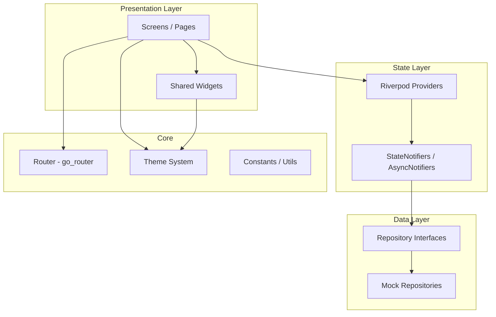
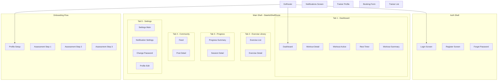

# Design Document: SynchroFit UI Screens

## Overview

This design document describes the architecture, components, and data models for the SynchroFit Flutter Android application's complete UI screen layer. The application implements 30+ screens across 11 feature modules, all using mock data and connected via centralized routing with go_router.

### Key Design Decisions

1. **Riverpod for State Management** — Selected over BLoC and Provider for its compile-safe providers, easy testability, and native support for async operations with `AsyncNotifier` patterns. The repository pattern maps naturally to Riverpod providers.

2. **go_router with StatefulShellRoute** — Provides declarative routing with support for bottom navigation that preserves per-tab navigation stacks. The redirect mechanism handles auth guards cleanly.

3. **Material Design 3 with ColorScheme.fromSeed** — Generates a harmonious, accessible color palette from a single seed color while supporting both light and dark themes with minimal configuration.

4. **fl_chart for Progress Visualizations** — A highly customizable Flutter charting library supporting line charts (for weight/BMI history) and bar charts (for weekly stats) with full theme integration.

5. **Feature-First Folder Structure** — Each module is self-contained with its own screens, widgets, providers, and models. Shared infrastructure lives in `lib/core/`.

## Architecture

### High-Level Architecture



### Project Structure

```
lib/
├── main.dart
├── app.dart                          # MaterialApp + ProviderScope
├── core/
│   ├── router/
│   │   ├── app_router.dart           # GoRouter configuration
│   │   ├── route_names.dart          # Named route constants
│   │   └── guards.dart               # Auth redirect logic
│   ├── theme/
│   │   ├── app_theme.dart            # Light + Dark ThemeData
│   │   ├── app_colors.dart           # Color palette
│   │   ├── app_text_styles.dart      # Typography scale
│   │   ├── app_spacing.dart          # Spacing constants
│   │   ├── component_themes.dart     # Button, input, card, appbar themes
│   │   └── theme.dart                # Barrel export
│   └── utils/
│       ├── validators.dart           # Form validation helpers
│       └── formatters.dart           # Date, time, relative timestamp formatters
├── features/
│   ├── auth/
│   │   ├── screens/
│   │   │   ├── login_screen.dart
│   │   │   ├── register_screen.dart
│   │   │   └── forgot_password_screen.dart
│   │   ├── providers/
│   │   │   └── auth_provider.dart
│   │   └── widgets/
│   ├── profile/
│   │   ├── screens/
│   │   │   ├── profile_setup_screen.dart
│   │   │   └── profile_edit_screen.dart
│   │   ├── providers/
│   │   │   └── profile_provider.dart
│   │   └── widgets/
│   ├── assessment/
│   │   ├── screens/
│   │   │   ├── bmi_step_screen.dart
│   │   │   ├── physical_info_step_screen.dart
│   │   │   └── goals_step_screen.dart
│   │   ├── providers/
│   │   │   └── assessment_provider.dart
│   │   └── widgets/
│   ├── dashboard/
│   │   ├── screens/
│   │   │   └── dashboard_screen.dart
│   │   ├── providers/
│   │   │   └── dashboard_provider.dart
│   │   └── widgets/
│   ├── workout/
│   │   ├── screens/
│   │   │   ├── workout_detail_screen.dart
│   │   │   ├── workout_active_screen.dart
│   │   │   ├── rest_timer_screen.dart
│   │   │   └── workout_summary_screen.dart
│   │   ├── providers/
│   │   │   ├── workout_provider.dart
│   │   │   └── timer_controller.dart
│   │   └── widgets/
│   ├── exercise_library/
│   │   ├── screens/
│   │   │   ├── exercise_list_screen.dart
│   │   │   └── exercise_detail_screen.dart
│   │   ├── providers/
│   │   │   └── exercise_provider.dart
│   │   └── widgets/
│   ├── progress/
│   │   ├── screens/
│   │   │   ├── progress_summary_screen.dart
│   │   │   └── session_detail_screen.dart
│   │   ├── providers/
│   │   │   └── progress_provider.dart
│   │   └── widgets/
│   ├── community/
│   │   ├── screens/
│   │   │   ├── feed_screen.dart
│   │   │   └── post_detail_screen.dart
│   │   ├── providers/
│   │   │   └── community_provider.dart
│   │   └── widgets/
│   ├── consultation/
│   │   ├── screens/
│   │   │   ├── trainer_list_screen.dart
│   │   │   ├── trainer_profile_screen.dart
│   │   │   └── booking_form_screen.dart
│   │   ├── providers/
│   │   │   └── consultation_provider.dart
│   │   └── widgets/
│   ├── notifications/
│   │   ├── screens/
│   │   │   └── notifications_screen.dart
│   │   ├── providers/
│   │   │   └── notifications_provider.dart
│   │   └── widgets/
│   └── settings/
│       ├── screens/
│       │   ├── settings_main_screen.dart
│       │   ├── notification_settings_screen.dart
│       │   └── change_password_screen.dart
│       ├── providers/
│       │   └── settings_provider.dart
│       └── widgets/
├── shared/
│   ├── widgets/
│   │   ├── loading_indicator.dart
│   │   ├── error_display.dart
│   │   ├── empty_state.dart
│   │   └── page_not_found_screen.dart
│   └── models/
│       ├── user.dart
│       ├── user_profile.dart
│       ├── exercise.dart
│       ├── workout.dart
│       ├── workout_session.dart
│       ├── post.dart
│       ├── comment.dart
│       ├── trainer.dart
│       ├── booking.dart
│       ├── notification_item.dart
│       └── progress_record.dart
└── data/
    ├── repositories/
    │   ├── auth_repository.dart          # Interface
    │   ├── profile_repository.dart
    │   ├── exercise_repository.dart
    │   ├── workout_repository.dart
    │   ├── community_repository.dart
    │   ├── consultation_repository.dart
    │   ├── notification_repository.dart
    │   └── progress_repository.dart
    └── mock/
        ├── mock_auth_repository.dart
        ├── mock_profile_repository.dart
        ├── mock_exercise_repository.dart
        ├── mock_workout_repository.dart
        ├── mock_community_repository.dart
        ├── mock_consultation_repository.dart
        ├── mock_notification_repository.dart
        ├── mock_progress_repository.dart
        └── mock_data.dart                # Seed data constants
```

### Navigation Architecture



### Routing Strategy

The router uses `StatefulShellRoute.indexedStack` to wrap the five primary tabs (Dashboard, Exercise Library, Progress, Community, Settings). Each tab maintains its own navigation stack independently via `StatefulShellBranch`. Routes outside the tab shell (Auth, Onboarding, Notifications, Consultation deep views) use the parent navigator key to render full-screen without the bottom nav.

**Auth Guard**: A `redirect` callback on GoRouter checks an `authStateProvider` (Riverpod). If the user is unauthenticated and the target is outside auth routes, redirect to login. If authenticated and navigating to auth routes, redirect to dashboard.

## Components and Interfaces

### Core Components

#### Theme System (`lib/core/theme/`)

| File | Responsibility |
|------|---------------|
| `app_theme.dart` | Exports `lightTheme` and `darkTheme` as `ThemeData` objects using `ColorScheme.fromSeed()` |
| `app_colors.dart` | Named color constants for the palette (primary, secondary, tertiary, surface variants, custom fitness-specific colors like success-green, rest-blue) |
| `app_text_styles.dart` | Defines headline, title, body, label, caption text styles using `GoogleFonts` or system fonts |
| `app_spacing.dart` | Spacing constants: `xs=4`, `sm=8`, `md=16`, `lg=24`, `xl=32`, `xxl=48` (dp) |
| `component_themes.dart` | `ElevatedButtonThemeData`, `InputDecorationTheme`, `CardTheme`, `AppBarTheme` |
| `theme.dart` | Barrel file exporting all theme elements via a single import |

Theme switching is managed via a `themeProvider` (Riverpod `StateProvider<ThemeMode>`) persisted to `SharedPreferences`.

#### Router (`lib/core/router/`)

```dart
// Simplified interface
final appRouterProvider = Provider<GoRouter>((ref) {
  final authState = ref.watch(authStateProvider);
  return GoRouter(
    initialLocation: authState.isAuthenticated ? '/dashboard' : '/login',
    redirect: (context, state) => _guardRedirect(authState, state),
    routes: [
      // Auth routes (no shell)
      GoRoute(path: '/login', ...),
      GoRoute(path: '/register', ...),
      GoRoute(path: '/forgot-password', ...),
      
      // Onboarding routes (no shell)
      GoRoute(path: '/profile-setup', ...),
      GoRoute(path: '/assessment/:step', ...),
      
      // Full-screen overlays
      GoRoute(path: '/notifications', ...),
      
      // Main tabbed shell
      StatefulShellRoute.indexedStack(
        branches: [
          StatefulShellBranch(routes: [/* Dashboard + Workout */]),
          StatefulShellBranch(routes: [/* Exercise Library */]),
          StatefulShellBranch(routes: [/* Progress */]),
          StatefulShellBranch(routes: [/* Community */]),
          StatefulShellBranch(routes: [/* Settings + Consultation */]),
        ],
      ),
    ],
    errorBuilder: (context, state) => PageNotFoundScreen(),
  );
});
```

#### Timer Controller (`lib/features/workout/providers/timer_controller.dart`)

A Riverpod `Notifier` that encapsulates Dart `Timer.periodic` logic for countdown behavior:

```dart
abstract interface class TimerControllerInterface {
  int get remainingSeconds;
  TimerState get state; // idle, running, paused, completed
  void start(int durationSeconds);
  void pause();
  void resume();
  void reset();
  void skip();
}
```

The timer operates entirely in the UI layer using `Timer.periodic` with 1-second intervals. No backend calls are involved.

### Repository Interfaces

Each repository follows this pattern:

```dart
abstract class ExerciseRepository {
  Future<List<Exercise>> getAll();
  Future<Exercise?> getById(String id);
  Future<List<Exercise>> search(String query);
  Future<List<Exercise>> filterByMuscleGroup(List<String> groups);
  Future<List<Exercise>> filterByDifficulty(String difficulty);
}
```

Mock implementations add artificial delays (200–500ms) via `Future.delayed` and operate on in-memory `List` collections. CRUD operations return `Result<T, AppError>` to simulate error states.

### Shared Widgets

| Widget | Purpose |
|--------|---------|
| `LoadingIndicator` | Centered spinner shown during async data fetches |
| `ErrorDisplay` | Error message with retry button |
| `EmptyState` | Centered icon + message for empty lists |
| `PageNotFoundScreen` | 404 with "Go to Dashboard" button |
| `ValidationErrorText` | Inline red text below form fields |
| `CustomCard` | Themed card with consistent padding/elevation |

### Form Validation

A centralized `validators.dart` utility provides reusable validation functions:

```dart
String? validateEmail(String? value);        // Non-empty + @ + domain
String? validatePassword(String? value);     // Min 8 chars
String? validateName(String? value);         // 1-50 chars
String? validateAge(String? value);          // 13-120
String? validateHeight(String? value);       // 50-300 cm
String? validateWeight(String? value);       // 20-500 kg
String? validateRequired(String? value);     // Non-empty/non-whitespace
String? validateMaxLength(String? value, int max);
String? validatePasswordMatch(String? password, String? confirm);
```

## Data Models

### Core Data Classes

```dart
class User {
  final String id;
  final String name;
  final String email;
  final DateTime createdAt;
}

class UserProfile {
  final String userId;
  final String name;
  final int age;
  final double heightCm;
  final double weightKg;
  final Gender gender;            // male, female, other
  final FitnessGoal fitnessGoal;  // loseWeight, buildMuscle, maintainFitness, improveEndurance
  final FitnessLevel fitnessLevel; // beginner, intermediate, advanced
  final WorkoutPreference workoutPreference; // home, gym, outdoor
  final List<DayOfWeek> workoutAvailability;
}

class Exercise {
  final String id;
  final String name;
  final String muscleGroup;
  final DifficultyLevel difficulty; // beginner, intermediate, advanced
  final List<String> instructions;
  final String? equipment;
  final int defaultDurationSeconds;
  final int defaultSets;
  final int defaultReps;
  final String imagePlaceholder;
}

class Workout {
  final String id;
  final String name;
  final int estimatedDurationMinutes;
  final List<WorkoutExercise> exercises;
}

class WorkoutExercise {
  final String exerciseId;
  final String exerciseName;
  final int sets;
  final int reps;
  final int durationSeconds;
  final int restSeconds;       // 10-120, default 30
  final String thumbnailPlaceholder;
}

class WorkoutSession {
  final String id;
  final String workoutId;
  final String workoutName;
  final DateTime completedAt;
  final int totalDurationSeconds;
  final int exercisesCompleted;
  final List<CompletedExercise> exercises;
}

class CompletedExercise {
  final String exerciseId;
  final String exerciseName;
  final int setsCompleted;
  final int repsOrDuration;
}

class Post {
  final String id;
  final String authorName;
  final String content;
  final DateTime timestamp;
  final int likeCount;
  final bool isLikedByCurrentUser;
  final List<Comment> comments;
}

class Comment {
  final String id;
  final String postId;
  final String authorName;
  final String text;          // max 500 chars
  final DateTime timestamp;
}

class Trainer {
  final String id;
  final String name;
  final String bio;
  final String specialization;
  final double rating;          // 1-5
  final int experienceYears;
  final List<TimeSlot> availableSlots;
  final String avatarPlaceholder;
}

class TimeSlot {
  final String id;
  final DateTime date;
  final String time;            // e.g., "09:00 AM"
  final bool isBooked;
}

class Booking {
  final String id;
  final String trainerId;
  final DateTime date;
  final String timeSlot;
  final ConsultationType type;  // inPerson, videoCall
  final String? notes;          // max 500 chars
}

class NotificationItem {
  final String id;
  final String title;           // max 80 chars
  final String description;     // max 200 chars
  final DateTime timestamp;
  final NotificationType type;  // workoutReminder, achievement, communityInteraction, systemUpdate
  final bool isRead;
}

class ProgressRecord {
  final String id;
  final DateTime date;
  final double weightKg;
  final double bmi;
  final int workoutsCompleted;
}
```

### Enums

```dart
enum Gender { male, female, other }
enum FitnessGoal { loseWeight, buildMuscle, maintainFitness, improveEndurance }
enum FitnessLevel { beginner, intermediate, advanced }
enum WorkoutPreference { home, gym, outdoor }
enum DifficultyLevel { beginner, intermediate, advanced }
enum ActivityLevel { sedentary, lightlyActive, moderatelyActive, veryActive }
enum ConsultationType { inPerson, videoCall }
enum NotificationType { workoutReminder, achievement, communityInteraction, systemUpdate }
enum DayOfWeek { monday, tuesday, wednesday, thursday, friday, saturday, sunday }
enum TimerState { idle, running, paused, completed }
```


## Correctness Properties

*A property is a characteristic or behavior that should hold true across all valid executions of a system — essentially, a formal statement about what the system should do. Properties serve as the bridge between human-readable specifications and machine-verifiable correctness guarantees.*

### Property 1: BMI Calculation Accuracy

*For any* valid height value in the range 50–300 cm and any valid weight value in the range 20–500 kg, the calculated BMI SHALL equal `weight / (height / 100)²` rounded to one decimal place.

**Validates: Requirements 5.7**

### Property 2: Form Validation Rejects Invalid Input

*For any* form in the application (Register, Login, Profile Setup, Profile Edit, Assessment steps, Booking, Change Password) and *for any* subset of required fields that are either empty, contain only whitespace, or contain values outside their specified valid range, the system SHALL display inline validation errors for each invalid field and SHALL prevent form submission or navigation advancement.

**Validates: Requirements 3.6, 4.4, 4.8, 5.6, 11.6, 13.4**

### Property 3: Password Confirmation Match

*For any* two strings provided as password and confirm password where the strings are not character-for-character identical, the system SHALL display a validation error indicating the mismatch and SHALL prevent form submission.

**Validates: Requirements 3.7, 13.5**

### Property 4: Email Format Validation

*For any* string that does not contain an "@" character followed by a domain segment (at least one character, a dot, and at least one more character), the system SHALL display an inline validation error indicating invalid email format.

**Validates: Requirements 3.11**

### Property 5: Exercise Filter Correctness

*For any* combination of selected muscle group filters and difficulty level filters applied to any exercise list, every exercise in the returned results SHALL have a muscle group matching at least one selected muscle group filter AND a difficulty level matching the selected difficulty filter. Additionally, *for any* search query string, every exercise in the returned results SHALL contain the query as a case-insensitive substring of its name.

**Validates: Requirements 8.2, 8.3**

### Property 6: Content Truncation

*For any* post with content of length greater than 150 characters, the displayed content on the Feed Screen SHALL show exactly the first 150 characters followed by an ellipsis ("…"). *For any* post with content of 150 characters or fewer, the full content SHALL be displayed without truncation.

**Validates: Requirements 10.1**

### Property 7: Like Toggle Consistency

*For any* post with a current like count of N, if the post is currently unliked by the user, tapping like SHALL result in a displayed count of N+1 and a liked visual state. If the post is currently liked by the user, tapping like SHALL result in a displayed count of N-1 and an unliked visual state.

**Validates: Requirements 10.4**

### Property 8: Comment Submission Validity

*For any* string containing at least one non-whitespace character (up to 500 characters), submitting it as a comment SHALL append a new comment to the top of the comment list with the current user as author, and SHALL clear the input field. *For any* string composed entirely of whitespace characters (including empty string), submission SHALL be rejected with a validation message and the comment list SHALL remain unchanged.

**Validates: Requirements 10.5, 10.6**

### Property 9: Notification Ordering

*For any* list of notifications provided by the Mock_Repository, the displayed list SHALL be ordered by timestamp descending (newest first), meaning for every adjacent pair of notifications (i, i+1) in the displayed list, `notification[i].timestamp >= notification[i+1].timestamp`.

**Validates: Requirements 12.1**

### Property 10: CRUD Collection Consistency

*For any* sequence of create, read, update, and delete operations on a Mock_Repository in-memory collection: (a) after a create operation, the collection size increases by one and the created item is retrievable by its ID; (b) after an update to an existing ID, reading that ID returns the updated values; (c) after a delete of an existing ID, the item is no longer retrievable; (d) *for any* ID not present in the collection, update and delete operations SHALL return an error result and the collection SHALL remain unchanged.

**Validates: Requirements 14.5, 14.6**

### Property 11: Undefined Route Handling

*For any* route path string that does not match any defined route in the Router configuration, the system SHALL render the PageNotFoundScreen with a navigation option to return to the Dashboard.

**Validates: Requirements 2.4**

### Property 12: Auth Guard Redirect

*For any* route path outside the Auth_Module routes, if the current user is unauthenticated, the Router SHALL redirect to the Login Screen. Conversely, *for any* Auth_Module route (login, register, forgot-password), if the current user is authenticated, the Router SHALL redirect to the Dashboard_Screen.

**Validates: Requirements 2.8, 2.9**

### Property 13: Workout Session Summary Accuracy

*For any* completed workout session containing N exercises with individual durations, the summary screen SHALL display: total duration equal to the sum of all exercise active times plus rest times, exercises completed equal to N, and a congratulatory message.

**Validates: Requirements 7.9**

### Property 14: Mock Repository Response Completeness

*For any* data object returned by any Mock_Repository provider, every field that maps to a UI-bound display element SHALL be non-null and non-empty (strings have length > 0, lists have at least one element where required, numeric values are within their valid domain).

**Validates: Requirements 14.4**

## Error Handling

### Strategy

All error handling follows a layered approach:

| Layer | Responsibility | Pattern |
|-------|---------------|---------|
| **Repository** | Return `Result<T, AppError>` for all operations | Sealed class with success/failure variants |
| **Provider/Notifier** | Map repository results to UI state | `AsyncValue<T>` (data, loading, error) |
| **Screen** | Display error feedback to user | Snackbars, inline errors, error state widgets |

### Error Types

```dart
sealed class AppError {
  String get message;
}

class NotFoundError extends AppError {
  final String entityType;
  final String id;
  String get message => '$entityType with id $id not found';
}

class ValidationError extends AppError {
  final Map<String, String> fieldErrors;
  String get message => 'Validation failed';
}

class AuthError extends AppError {
  final String reason;
  String get message => reason;
}

class NetworkError extends AppError {
  String get message => 'Network error occurred';
}
```

### Error Display Patterns

1. **Form Validation Errors** — Inline red text below each invalid field, rendered via `TextFormField.validator` returning error strings from `validators.dart`.

2. **Auth Errors** (invalid credentials, registration failure) — `SnackBar` displayed via `ScaffoldMessenger` with a brief error description.

3. **Data Load Errors** — `ErrorDisplay` widget with retry button, shown when `AsyncValue` is in error state.

4. **Not Found (404 Route)** — `PageNotFoundScreen` with "Go to Dashboard" button.

5. **CRUD Errors** (update/delete non-existent record) — `SnackBar` with error description; UI state remains unchanged.

### Loading States

All data-fetching screens show a `LoadingIndicator` while the `AsyncValue` is in loading state. The mock repository's 200–500ms delay ensures loading states are visible during development.

## Testing Strategy

### Overview

Testing for this feature uses a **dual approach**:

- **Property-based tests** verify universal correctness properties across generated inputs (validation logic, data transformations, filtering, CRUD consistency)
- **Widget tests** verify specific UI rendering, navigation, and interaction examples
- **Unit tests** verify isolated business logic (formatters, validators, timer state machine)

### Property-Based Testing

**Library**: `dart_check` (or `glados` as alternative) — Dart property-based testing libraries that integrate with `package:test`.

**Configuration**:
- Minimum 100 iterations per property test
- Each test tagged with feature and property reference
- Tag format: `// Feature: synchrofit-ui-screens, Property {N}: {property_text}`

**Properties to Implement**:

| Property | Target Code | Generator Strategy |
|----------|------------|-------------------|
| 1: BMI Calculation | `assessment_provider.dart` | Random doubles: height 50-300, weight 20-500 |
| 2: Form Validation | `validators.dart` | Random strings with controlled invalid values (empty, out-of-range) |
| 3: Password Match | `validators.dart` | Pairs of random strings guaranteed non-equal |
| 4: Email Validation | `validators.dart` | Random strings without valid email structure |
| 5: Exercise Filter | `exercise_provider.dart` | Random exercise lists + random filter combinations |
| 6: Content Truncation | Community display logic | Random strings of varying lengths (0-1000 chars) |
| 7: Like Toggle | `community_provider.dart` | Random post with random like count + random liked state |
| 8: Comment Validity | `community_provider.dart` | Random strings (valid non-whitespace and whitespace-only) |
| 9: Notification Ordering | `notifications_provider.dart` | Random lists of notifications with random timestamps |
| 10: CRUD Consistency | Mock repository classes | Random sequences of CRUD operations with random data |
| 11: Undefined Routes | `app_router.dart` | Random path strings not in defined route set |
| 12: Auth Guard | `app_router.dart` | Random protected routes × auth states |
| 13: Workout Summary | `workout_provider.dart` | Random workout sessions with varying exercise counts/durations |
| 14: Mock Data Completeness | All mock repositories | Enumerate all repository methods and check returned fields |

### Widget Testing

Framework: `flutter_test` (built-in)

**Coverage**:
- Each screen renders without exceptions
- Navigation between screens works correctly
- Form fields accept input and display validation
- Interactive elements respond to taps
- Empty states display when no data available
- Theme switching changes widget appearance

### Unit Testing

Framework: `package:test` with `package:mocktail` for mocking

**Coverage**:
- `validators.dart` — all validation functions with specific edge cases
- `formatters.dart` — relative timestamp formatting, duration formatting
- `timer_controller.dart` — state transitions (idle→running→paused→running→completed)
- BMI calculation function
- Content truncation logic

### Integration Testing

Framework: `integration_test` (Flutter built-in)

**Coverage**:
- Full auth flow: register → profile setup → assessment → dashboard
- Full workout flow: dashboard → workout detail → active → rest → summary
- Navigation between all tabs preserves state
- Theme persistence across app restarts

### Test File Organization

```
test/
├── core/
│   ├── router/
│   │   └── app_router_test.dart          # Route resolution, guards
│   ├── theme/
│   │   └── app_theme_test.dart           # Theme existence, structure
│   └── utils/
│       ├── validators_test.dart          # Unit + property tests
│       └── formatters_test.dart          # Unit tests
├── features/
│   ├── auth/
│   │   └── screens/
│   │       ├── login_screen_test.dart
│   │       ├── register_screen_test.dart
│   │       └── forgot_password_screen_test.dart
│   ├── workout/
│   │   ├── providers/
│   │   │   └── timer_controller_test.dart
│   │   └── screens/
│   │       └── workout_active_screen_test.dart
│   ├── exercise_library/
│   │   └── providers/
│   │       └── exercise_provider_test.dart  # Filter/search property tests
│   ├── community/
│   │   └── providers/
│   │       └── community_provider_test.dart # Like, comment, truncation tests
│   ├── notifications/
│   │   └── providers/
│   │       └── notifications_provider_test.dart # Ordering property test
│   └── ...
├── data/
│   └── mock/
│       └── mock_repository_test.dart      # CRUD consistency property tests
└── properties/
    └── synchrofit_properties_test.dart    # Consolidated property tests
```
